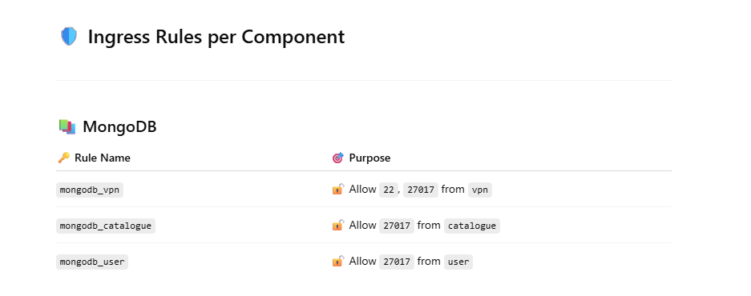

🔐 Roboshop Security Groups & Ingress Rules

# 🛡️ Ingress Rules per Component
📚 MongoDB
    Rule Name	Purpose
    mongodb_vpn	Allow 22, 27017 from vpn
    mongodb_catalogue	Allow 27017 from catalogue!
    mongodb_user	Allow 27017 from user

⚡ Redis
    Rule Name	Purpose
    redis_vpn	Allow 22, 5679 from vpn
    redis_user	Allow 5679 from user
    redis_cart	Allow 5679 from cart

🗄️ MySQL
    Rule Name	Purpose
    mysql_vpn	Allow 22, 3306 from vpn
    mysql_shipping	Allow 3306 from shipping

📨 RabbitMQ
    Rule Name	Purpose
    rabbitmq_vpn	Allow 22, 5672 from vpn
    rabbitmq_payment	Allow 5672 from payment

🧩 Catalogue
    Rule Name	            Purpose
    catalogue_vpn	Allow 22 from vpn
    catalogue_backend_alb	Allow 8080 from backend_alb